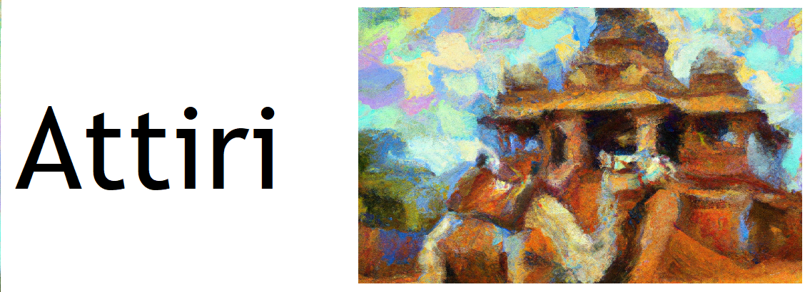
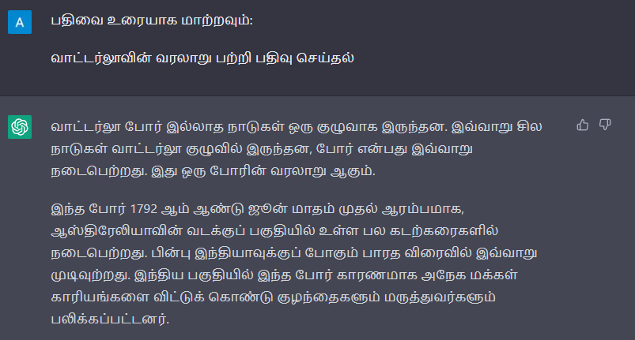
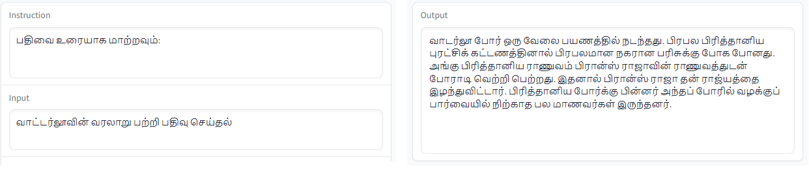

<p align="center" width="100%">
<a href="https://adithyabalaji.notion.site/Attiri-A-LLaMa-Model-for-Tamil-d49b91e2d7704c3286fd4ac4c1934c18" target="_blank"></a>
</p>

<h1 align="center">
  <br />
  Attiri: Dataset and an instruction-following large language model for Tamil based on LLaMa and Stanford Alpaca
</h1>

<div align="center">

  <a href=""></a>
  <a href=""></a>
  <a href=""></a>

</div>

Attiri, an extension of the LLaMa and Stanford Alpaca, aims to build and share an instruction-following language model for the Tamil language. 
Recent breakthrough in LLM, such as LLaMA, LaMDA and GPT-4, have introduced the potential for Artificial General Intelligence (AGI) and sparked widespread attention from the industry. However, the high cost of training and deployment has made it difficult to promote transparent and open academic research in the field. In response, a project has taken steps to promote open research in the Tamil natural language processing (NLP) community by releasing the Tamil LLaMA model and the Alpaca large model as open-source resources. These models expand the Tamil vocabulary and improve basic semantic understanding by utilizing secondary pre-training on Tamil data. Additionally, the project uses Tamil instruction data for fine-tuning the Tamil LLaMA model, enhancing the model's ability to understand and execute instructions. It is important to note that these resources are solely intended for academic research purposes.

 We also release a minimum viable model weight to the [huggingface model hub](https://huggingface.co/adithya-balaji/attiri-llama).

The repository contains

- Dataset
- Code to generate the data
- Code to fine tune LLaMA 7B model

## Table of Contents

1. [Preparation](#preparation)
   1. [Setup](#setup)
   2. [Dataset](#dataset)
2. [Usage](#usage)
    1. [Translate](#translate-data-from-english-to-tamil)
    2. [Finetuning](#finetuning-the-model-for-tamil)
3. [Citation](#citation)
4. [To Contribute](#to-contribute)
5. [To-Do](#to-do)
6. [Acknowledgments](#acknowledgments)
7. [License](#license)
8. [Fun-Fact](#fun-fact)

## Preparation

### Setup

To use the program, you must have Python 3.9+ (recommended = 3.9) and the necessary packages installed. You can install the necessary packages using pip:

Create a new Conda environment with Python 3.9:

```bash
conda create --name attiri python=3.9
```

Activate the new environment:

```bash
conda activate attiri
```

```bash
pip install -r requirements.txt
```

### Dataset

| S.No | Dataset | Description | Count | I/O    |
|------|---------|-------------|-------|--------|
| 1    | [Attiri-Alpaca](data/attiri_alpaca_data.json)  | Tamil version of the Stanford Alpaca dataset | 52K| Instruction, Input, Output|
| 2    | [Attiri-Nomic](https://drive.google.com/drive/folders/1_uNWzjNJ8R-57Rd6N-ybYisDf6Ig8-eG?usp=share_link)  | Tamil version of the Nomic AI GPT4ALL dataset | 500K | Prompt, Response|
| 3    | [IndicCorp](https://ai4bharat.iitm.ac.in/corpora)| A single large text file containing one sentence per line. The publicly released version is randomly shuffled, untokenized and deduplicated. | 31.5M| Sentences|

``attiri_data.py`` translates instruction data for the Alpaca dataset from one language to another using the Google Translate API. The program is built with Click and tqdm for command-line argument parsing and progress tracking, respectively.

Attiri Nomic data is available on request, including a csv file with the prompt and response in English and their corresponding tamil translations. To Request : [Click Here](https://drive.google.com/drive/folders/1_uNWzjNJ8R-57Rd6N-ybYisDf6Ig8-eG?usp=share_link)

## Usage

Here are some examples of how to use the program:

### Translate data from English to Tamil

Translate data from alpaca_data.json in English to Tamil and save it to output.json:

```shell
python attiri_data.py \
--source en \
--target ta \
--dataset alpaca \
--input alpaca_data.json \
--output output.json
```

Alternatively ``-s`` and ``-t`` can be used instead of ``--source`` and ``--target`` and ``-i`` and ``-o`` can be used instead of ``--input`` and ``--output`` respectively.

### Finetuning the model for tamil

The `parameters.json` file contains the configuration parameters for running the model. Make sure to update the parameters in `parameters.json` according to your specific use case before running the model.

Now you can run finetune the model using the following steps:

```python
import attiri.finetune as ft
trainer = ft.LlamaTrainer(BASE_MODEL_PATH, DATAL_PATH )
trainer.train()
```

A minimum viable model weight is released to the huggingface model hub. You can find it [here](https://huggingface.co/adithya-balaji/attiri-llama). (Note this is not a fully working model yet. Further models will be released as the project progresses)

To view a quick demo of the model, please follow the instructions below:

Clone the alpaca-lora repository:

```shell
git clone https://github.com/tloen/alpaca-lora.git
cd alpaca-lora
git checkout a48d947
```

To launch the demo, run the following command:

```shell
python generate.py \
  --load_8bit \
  --base_model 'decapoda-research/llama-7b-hf' \
  --lora_weights 'adithya-balaji/attiri-lama' \
  --share_gradio
```

## Citation

Please cite this project if you use the dataset, model or code in this repo. (Note: Naturally you should also cite the original LLaMA, Stanford Alpaca, and LoRa papers)

```BibTeX
@misc{Attiri,
  author = {Adithya Balaji},
  title = {Attiri: Dataset and a LLaMa based instruction-following large language model for Tamil},
  year = {2023},
  publisher = {GitHub},
  journal = {GitHub repository},
  howpublished = {\url{https://github.com/adithyab94/Attiri}},
}
```

## To Contribute

This project is actively looking for collaborators. If you are interested in contributing to this project, please raise a pull request or [write to me](mailto:adithya.b94@gmail.com)

## To-Do

- [X] Translate alpaca json data into Tamil
- [X] Translate nomic json data into Tamil
- [X] Clean training data
- [X] Finetuning with LLaMA uing Local GPU
- [X] Release mvp model
- [X] Output model to hugging face
- [X] Demo UI (Hugging Face) [``PARTIAL``:Self-hosted app]
- [ ] Finetuning using Cloud GPU (minimum: 8x A100s 80GB memory)
- [ ] Release v1.0 model
- [ ] Finetuning the 13B, 33B ,65B models using Cloud GPU (minimum: 8x A100s 80GB memory)
- [ ] Output models to hugging face
- [ ] Demo UI (Hugging Face / Hosted app)

### Future pipeline

#### Datasets

- [ ] Prepare organic dataset customized to suit Tamil language
- [ ] Prepare organic dataset customized to suit Kondunthamizh and Romanized Tamil

#### Extending to other languages

- [ ] Prepare dataset for other languages
- [ ] Finetune to create language models

#### Extending to other LLM

- [ ] Finetune other LLMs like PaLM, Flan, GPT and Compare results

#### Toxicity and Abuse Detection

- [ ] Prepare Toxicity and abuse detection dataset
- [ ] Finetune to create safe language model

## Results

LLaMA 7B model is not finetuned for Tamil. The model is finetuned for languages with Latin script. The Alpaca model hence performs poorly for tamil prompts.


On the other hand, ChatGPT performs better comparitively but it doesnt generate meaningful responses.


Attiri model is finetuned for Tamil and hence performs better than Alpaca just with the pre-release model. Hence it shows great potential to have a large language model customized for Tamil.



## Acknowledgments

Thanks for the open source projects - [LLaMA](https://github.com/facebookresearch/llama), [Stanford Alpaca](https://github.com/tatsu-lab/stanford_alpaca), and [Alpaca-Lora](https://github.com/tloen/alpaca-lora) from which this project is inspired.

Thanks to the [AI4Bharat](https://ai4bharat.iitm.ac.in/) team for the [IndicCorp](https://ai4bharat.iitm.ac.in/corpora) dataset.
and [Nomic](https://github.com/nomic-ai/gpt4all) for the  GPT4ALL dataset.  

## License

This project is licensed under the GNU General Public License v3.0. See the [LICENSE](LICENSE) file for details.

## Fun-Fact

The word "Attiri" (["அத்திரி"](https://agarathi.com/word/%E0%AE%85%E0%AE%A4%E0%AF%8D%E0%AE%A4%E0%AE%BF%E0%AE%B0%E0%AE%BF)) is used by the poet Ilango in the famous Tamil epic Silappadikaram which acccording to the Tamil dictionary could be a camel, a distant relative of the Llamas and Alpacas.

  வான வண்கையன் அத்திரி ஏற\
  மான் அமர் நோக்கியும் வையம் ஏறிக்\
  கோடி பல அடுக்கிய கொழிநிதிக் குப்பை..\
  \
  *- கடலாடு காதை, சிலப்பதிகாரம்*
